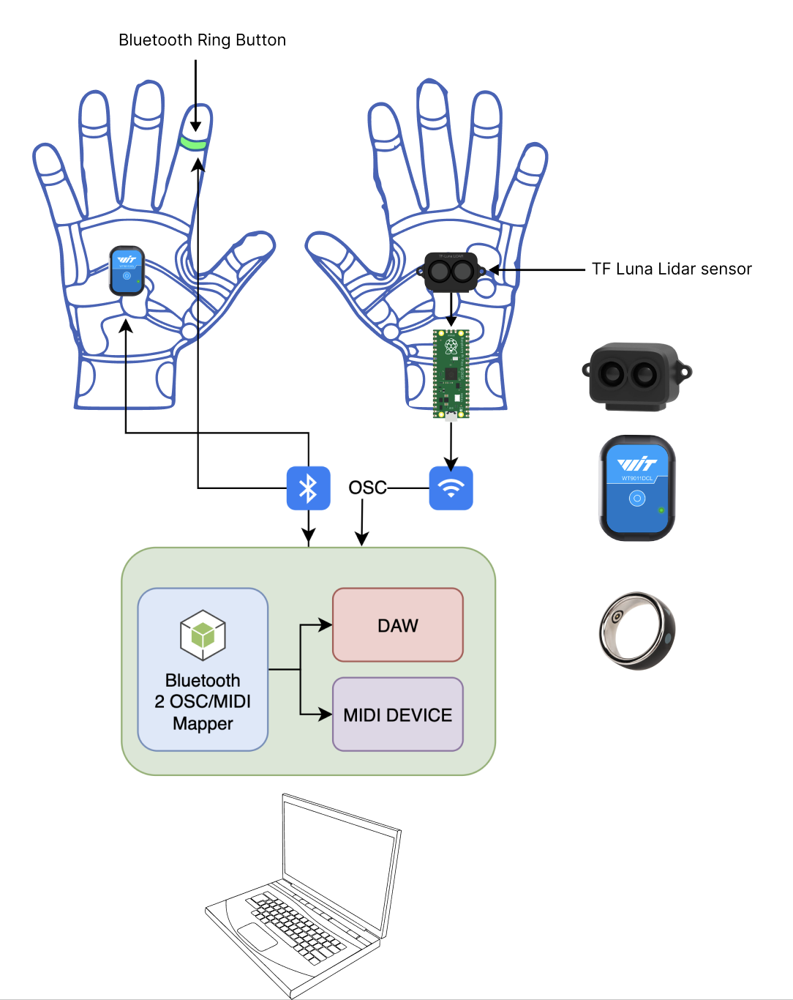

# Ardeidae 🪶

Ardeidae is an aggregator for Bluetooth HID devices and IMU sensors, mapping their data to OSC messages.

## Features
- Supports multiple Bluetooth HID devices / IMU sensors (e.g., remote control rings, accelerometers)
- Maps device inputs to OSC messages
- Automatically reconnects on disconnection

## Purpose

This project is all about building the software for a musical glove that lets you control a DAW or instrument using OSC/MIDI. It combines motion data from an accelerometer with button inputs from a Bluetooth ring, making it possible to interact with music



## Installation
```sh
npm install
```

## Usage
```sh
npm start
```
Ensure your Bluetooth devices are paired and connected before running.

## Future Improvements
- Add accelerometer support
- CLI configuration for OSC mappings
- GUI/TUI interface
